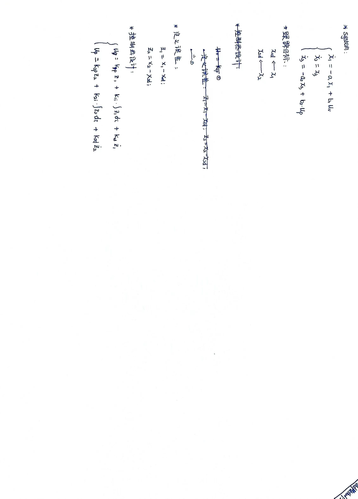
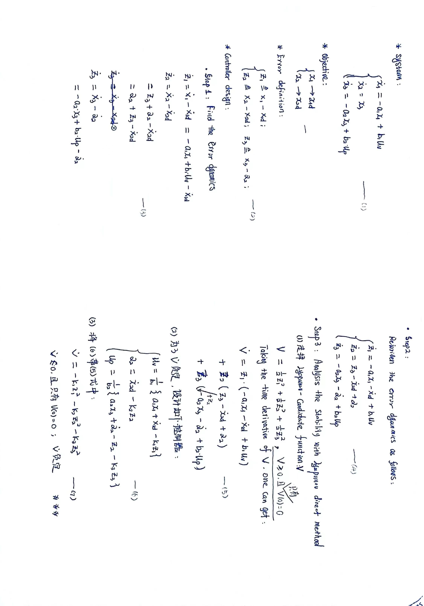
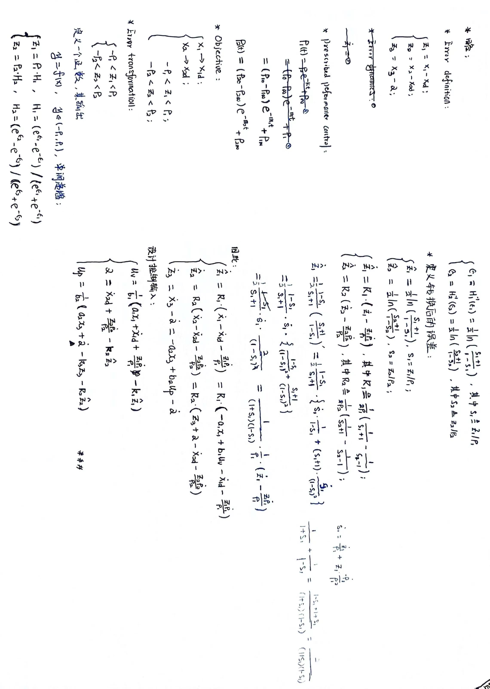

This is the Standard Matlab codes for all comparison methods.
-------------------------------------------------------------
主要包含:
    @1PID
    @2Backstepping
    @3tPPC
    @4PPTPTC
-----------------------------------------------------------------------------------------------------------------------------
@PID control method: 
 

    #1标签: PID method
-------------------------------------------------------------------------------------------------------------
@Backstepping control method: 
 

    #1标签：Backstepping control method
------------------------------------------------------------------------------------------------------------------------
@tPPC control method: 
 

    #1标签：traditional prescribed performance control method
------------------------------------------------------------------------------------------------------------------------

@PPTPTC control method: 
    
    #1标签：Please refer to the reference [23]
------------------------------------------------------------------------------------------------------------------------

